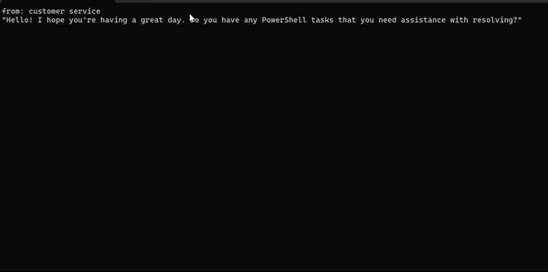
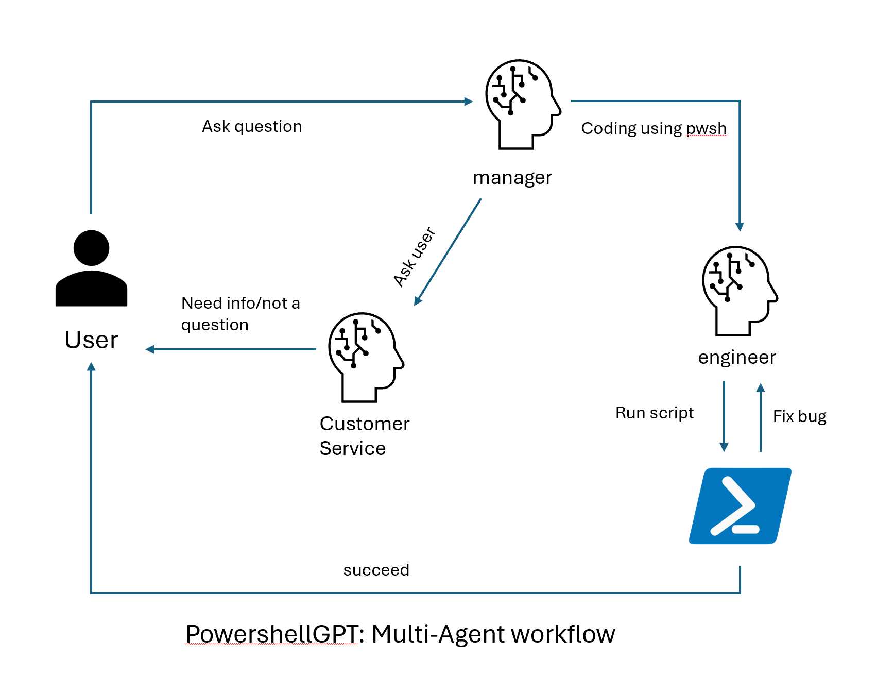

## PS.GPT

A dotnet tool which uses multi-agent workflow to resolve tasks using powershell scripts.

To those who struggles with lengthy powershell command.

 


### Get start
> [!Note]
> Before running the tool, you need to set up the following environment variables:
> - `OPENAI_API_KEY`: The key of the OpenAI service.
> - `OPENAI_MODEL_ID`: The model to use, if not set, it will use the `gpt-3.5-turbo-0125`.
> 
> If you want to use Azure OpenAI service, you need to set up the following environment variables:
> - `AZURE_OPENAI_ENDPOINT`: The endpoint of the Azure OpenAI service.
> - `AZURE_OPENAI_KEY`: The key of the Azure OpenAI service.
> - `AZURE_OPENAI_DEPLOY_NAME`: The model of the Azure OpenAI service.

#### Install the tool
```bash
dotnet tool install -g PS.GPT
```
#### Run the tool using ps-gpt command
```bash
ps-gpt
```
#### Ask your question
```bash
list all files assending by size
```

### Examples
Below are some examples of the tasks that can be resolved using this workflow.

#### listing all files and its size, and sort by size in descending order.


### Workflow overview


### Agents overview
- User: accepts user input and send it to manager
- Manager: Create task based on received user question. If the question is non-related to powershell or require more information, it will be sent to customer service for further assistance. Otherwise, it will be sent to enginner for resolution.
- Engineer: Resolve the task using powershell script and send script to powershell agent for execution.
- Powershell: Execute the script. If succeed, the result will be sent directly back to user. Otherwise, it will be sent to engineer for fixing.
- Customer service: Asking user for more information or send the question back to user if it is non-related to powershell.

### Extending the workflow
The workflow can be easily extended to support the following scenarios:
- approve script before execution: Asking user for approval before executing the script.
- support more bash languages: Adding more engineers!
